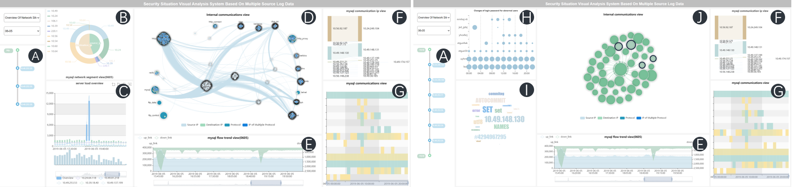

# 基于SEMMA的网络安全事件可视探索
本项目获得中国电子协会举办的长风杯比赛西南赛区二等奖，并发表于中文核心期刊《浙江大学学报》

## 1：项目概述

- - - - -  #####  A.Timeline 图；B.嵌套饼图；C.流量折线图；D.PBNLD 图；E.流量双折线图；F.Sankey 图；G.热力图；
- - - - - - - - - - - - - - - - - - - - - - - - - - - ##### H.密码气泡图；I.词云图；J.主机行为聚类图。
- 网络安全可视化能够直观地提取网络安全特征、全方位感知网络安全态势，但如何对网络安全的整体分析流程进行宏观把控仍然是一个研究难题。针对此问题，本文引入数据挖掘中经典的**SEMMA(Sample -Explore-Modify-Model-Assess)分析范式**并结合网络安全可视化提出一套通用的网络事件分析模型，将分析过程划分为**数据处理、行为特征探索、异常对象定位、异常事件描述与行为模式关联分析等**具体步骤，从而规范安全事件探索分析流程。同时在特征探索环节引用**模糊C均值算法**量化主机行为，识别网络资产结构；提出新颖的可视化表征形式—**PBNLD**( Protocol-based Node Link Diagram) 构建网络通信模型，以提升大规模节点的绘制质量。以安全事件分析模型为指导，面向多源安全日志实例数据，搭建了网络安全事件可视探索系统，通过多视图协同与故事线回溯的方式实现**网络资产划分、网络异常事件提取和攻击事件演化**。最后，实验结果证明分析模型的有效性。

## 2：数据概述
- 本文使用的网络日志数据集取自某高新技术企业公司，该公司内部重要系统被攻击，导致重要数据发生泄漏。日志数据跨度共14天，主要包含三种类型:
-  1) **tcpflow日志**：该日志为传输层的数据传输记录，包含记录的生成时间、使用协议、目的端口和上、下行数据包的字节数等。
-  2) **db日志**: MYSQL数据库日志包含记录的生成时间、客户端IP地址、目标地址和用户的SQL语句操作。
-  3) **login日志**: 记录FTP、SMTP、POP、SMB和数据库中用户登录情况，除基本的信息之外，还包含用户登录名、用户状态(主要包括登录成功、登录失败、密码错误、密码修改成功等) 和用户经过加密后的登录密码。

## 3：安全事件分析模型
- 参照Zhang等在TIFS中提出针对一系列针对网络的全局属性、平均攻击力度的多样性互补指标，本文将提取网络安全事件的关键因素归纳为**4W1H (＂When＂、＂Where＂、＂What＂、＂Who＂、＂How＂)** ，即:
- 1) 	在过去的哪些时间段，内部网络可能发生过重要事件？这里的重要事件包括系统更新、非工作时间段内的服务器的高负载、数据库的访问量激增等。
- 2) 	在这些重要事件当中，是否存在非周期性活动？这些活动是在网络结构的哪个部位发生的？
- 3) 	针对发现的可疑活动，在网络结构中的主要表现是什么？可疑活动造成的影响有哪些？ 
- 4) 	可否通过日志数据之间的关系映射，定位攻击源？这里的攻击源包括攻击IP、攻击者和攻击类型。
- 5) 	在初步确定了事件发生的时间、位置和内容后，通过对受害资产与内网流量分析能否在一定程度上能还原攻击者的攻击路径与攻击手法？

## 4：分析模块
### a):基于通信协议的节点链路图—PBNLD
- 客户端常存在与多个服务器进行通信且单个通信对使用协议不一致的情况。若简单使用传统关系图对网络通信流进行可视化，易造成图元重叠，致使很多有效信息被遮挡。为解决上述问题，PBNLD同传统的网络关系图一样，仍使用节点/顶点和连线来编码网络通信之间的关联关系，但其在绘制中**引入＂协议＂和聚类计算结果**，实现对节点簇的协议分类和信息补充，提升对大量通信网络的节点呈现速率。PBNLD 分为三部分，分别为协议（节点与其内部的节点）簇、源 IP 节点簇和通信链路（图 2）。在通信协议节点中，用圆形半径编码日志数据中协议的使用情况，用灰度编码使用协议不同类型的 IP 节点，用 PBNLD 可视化主机通信记录。快速构建以协议为划分标准的网络通信结构，识别主机的网络结构角色。
- 

### b):企业资产结构分析
- 分析多源日志数据中可能存在的异常安全事件首先要提取网络结构特征，识别并分类企业资产。本文结合嵌套饼图和基于模糊C均值的主机聚类识别网络资产,初步提取以下特征：
- （1）在 PBNLD 中，发现该企业通信协议中包含HTTP、MYSQL、REDIS 与 FTP，即该企业内部网络资产中除常用的工作组服务器外，可能还包括FTP 文件服务器、MYSQL 数据库服务器、REDIS存储数据服务器
- （2）在对网络资产进行分类时，以 HTTP 协议为例，分别从源 IP 与目标 IP 两方面统计网络通信量最大的前 5 个网段。企业客户端通信量最大的前 5 个网段为 10.49，10.56，10.60，10.54，10.65，目标网段访问量最大的前 5 个 网 段 分 别 为 10.49，10.24，220.181，180.149，10.39。即公司业务均在内网进行，其中以 10.49 网段最为活跃，初步判断该网段运行公司关键业务。
- （3）在目标网段中，220.181 与 180.149 网段分别为公网 C 类地址和公网 B 类地址，其余均为内部网段，可合理判断公司内部网络通过上述 2 个网段连接至互联网，即 220.181 与 180.149 为该公司路由器IP 地址范围。

- 

### c):基于用户的异常行为探索
- 监测异常活跃主机及数据库访问量的变化情况，可辅助聚焦企业内部异常员工，确定用户行为模式，描绘用户行为画像。按照本文提出的网络安全事件分析模型，在点击 PBNLD 中的 MYSQL 协议
节点后，得到针对 MYSQL 协议的各类可视图，辅助特征探索。按照 4W1H 原则，初步提取以下特征：
- （1）借 助 密 码 气 泡 图 ，可 发 现 在 6 月 10 日 00：00，用户 jxd_gdxj 的数据库密码有反常的高频修改行为，在 1 h 内，密码共修改 1 627 次；
- （2）在 Timeline 视 图 记 录 该 用 户 并 回 溯 至PBNLD 中，从高亮关系中可看出，当日该用户仅与数据库服务器存在数据交流；
- （3）借助词云图呈现该用户的 SQL 操作，确定该用户高频使用“set”“select”“autocommit”等语句对数据库中“cars7295”表单进行查询修改操作；
- （4）通过监控该用户的上/下行流量发现，该主机 在 当 日 凌 晨 01：25 的 上 、下 行 流 量 各 出 现 一 次激增。

-  综上所述，可初步得到员工 jxd_gdxj 的行为画像。jxd_gdxj 可能是一名具有高权限的数据库管理人员，其在企业内网的 IP 地址为 10.56.92.187。6 月10 日 00：00，其数据库登录密码遭到攻击者的暴力破 解 ，并 在 01：25 之 前 破 解 成 功 。 攻 击 者 利 用jxd_gdxj 的 数 据 库 权 限 不 断 查 询 IP 地 址 为10.24.249.104 的 企 业 数 据 库 内 部 含 敏 文 件 ，并 在
01：25—01：35 成功下载至本地。攻击者还利用该用户的写权限，成功上传“后门”文件，以达到日后绕过系统安全设置，直接获取对数据库的访问权限的
目 的 。 6 月 10 日 与 该 数 据 库 通 信 的 IP 地 址 还 有10.49.21.15 和 10.56.92.125，通 信 频 数 分 别 为 7 和14，与企业内部的正常访问频次相符，排除被攻击的可能。
- 

### d):基于网络流量的异常行为探索
- 拒绝服务攻击和恶意代码扩散在流量方面体现出一对一、一对多等特征，造成流量异常。对网络流量监控可以帮助管理员快速准确发现网络攻击，分类攻击类型。在对比分析PBNLD中的http协议节点后，发现在对企业多日的流量监控中，企业日常数据流量存在相似性。初步提取了以下特征：
- （1）6 月 10 日 20：50—22：50，通过服务器负载监 控 视 图 ，发 现 web 服 务 器 10.24.64.118，10.24.172.153，10.49.253.53 与 10.49.17.199 负载激增。此时段上述服务器均宕机，通信频次和通信总量均为 0。
- （2）利用 Timeline 视图记录与发生宕机的服务器地址通信的主机 IP 地址并回溯于系统各个视图中，确定嫌疑主机包括 10.49.137.7，10.56.131.163，10.49.253.35 等。
- （3）以 10.49.137.7 为例，借助基于流量的双折线图和 Sankey 图的协同交互，在 6 月 10 日、6 月 11日、6 月 13 日晚，发现 IP 地址为 10.49.137.7 的嫌疑主机上/下行流量走势呈规律性变化，持续向某服务器发送相同大小的数据包并下载某文件。根据上述特征，初步判定攻击者可能对公司服务器实施了 DDOS 攻击，使其对外拒绝服务，业务无法正常运作，即企业内部 IP 地址为 10.49.137.7，10.56.131.163，10.49.253.35 的 主 机 因 3389 端 口 开放，感染木马病毒或存留有后门程序，被攻击者一对多或多对多远程控制，集体制造高流量无用数据，消耗公司对内业务的 web 服务器，致使其网络瘫痪，服务器系统崩溃，发生宕机。
- 

## 5): 总结
- 文引入数据挖掘中经典的SEMMA分析范式提出了一个通用的安全分析模型，**规范监测和提取异常事件的分析思路**，设计并实现了一个**基于SEMMA的网络安全事件可视探索系统**，系统结合**模糊C均值算法**量化主机行为，识别网络资产结构，并使用新颖的可视化方法—--**PBNLD**来构建通信模型，以此来实现对较大规模通信节点的分析。从结果来看，本文从多种维度衡量安全特征之间的关联关系，有效构建了企业内部网络资产结构。 
结合用户评估，本文将在以下两个方面进行后续改善:
- 1) 完善PBNLD通信模型，考虑将PBNLD中的通信链路与通信频次或通信量进行绑定，更好呈现节点簇中所有的IP节点。
- 2) 在研究中加入机器学习，采用**无监督学习的方式**让安全特征的提取和异常事件的定位更加**智能化**，并允许分析人员在特征选择过程中实时进行交互。

